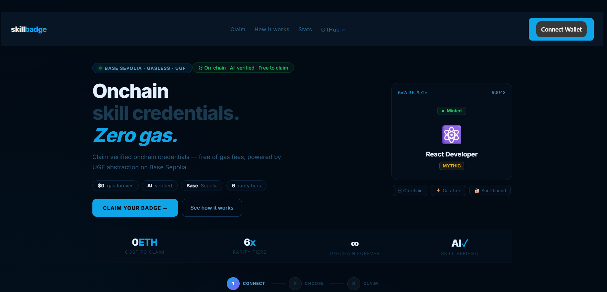
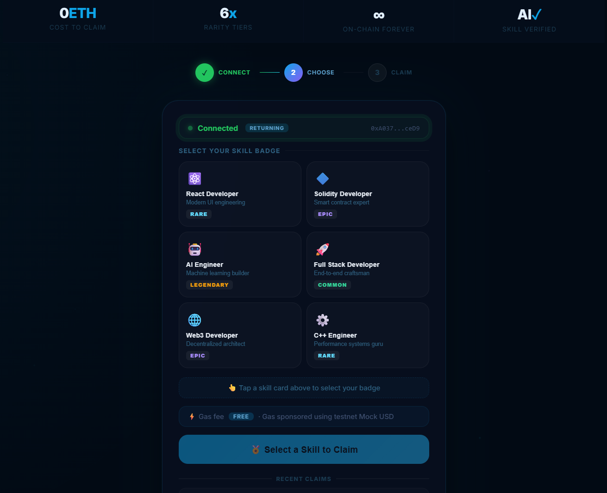
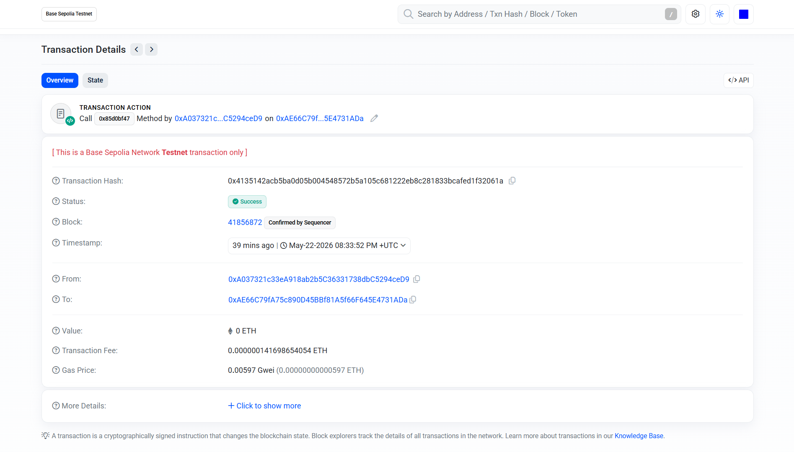

# SkillBadge — Onchain Skill Credentials. Zero Gas.

**Claim verified, soul-bound skill badges on Base Sepolia — without ever needing ETH.**

SkillBadge lets developers mint onchain credentials for their skills (React, Solidity, AI Engineering, etc.) with gas sponsored by **UGF (Universal Gas Framework)**. Users pay in testnet **Mock USD (TYI_MOCK_USD)** inside the UGF modal — no Base Sepolia ETH required for gas.

Built for the **Universal Gas Framework Hackathon** on Base Sepolia.

**Live app:** [https://blockchain-one-gules.vercel.app/](https://blockchain-one-gules.vercel.app/)

---

## What it does

1. Connect a wallet (MetaMask / WalletConnect via ConnectKit).
2. Sign in with **SIWE** (Sign-In with Ethereum) against the backend API.
3. Pick a skill badge from six roles (each with a rarity tier).
4. Confirm gas payment in the **UGF modal** (Mock USD).
5. UGF sponsors execution on Base Sepolia; the badge is minted soul-bound to your wallet.
6. View receipt, inventory, and recent claims with BaseScan links.

You can claim **multiple different badges** from the same wallet; already-owned skills are marked on the grid.

---

## Screenshots

### Landing Page


### Pick Your Badge


### Transaction Receipt


---

## How it works

```
Connect wallet (ConnectKit)
        ↓
SIWE auth → backend JWT (Supabase user record)
        ↓
Pick a skill badge
        ↓
UGF testnet: quote + pay gas in TYI_MOCK_USD (modal)
        ↓
UGF sponsors tx → claimBadge() on Base Sepolia
        ↓
Receipt + inventory + history updated
```

No app-side paymaster, bundler, or ERC-4337 setup — the dApp encodes `claimBadge(skill)` and opens UGF.

---

## Badge types

| Badge | Rarity |
|-------|--------|
| React Developer | Rare |
| Solidity Developer | Epic |
| AI Engineer | Legendary |
| Full Stack Developer | Common |
| Web3 Developer | Epic |
| C++ Engineer | Rare |

---

## Tech stack

| Layer | Technology |
|-------|------------|
| Frontend | React 19, Vite 8 |
| Gas abstraction | `@tychilabs/react-ugf` (testnet mode) |
| Wallet | ConnectKit, wagmi, viem, ethers v6 |
| Auth | SIWE + JWT (`siwe` package) |
| Backend | Express 5, Supabase |
| Chain | Base Sepolia (chain ID `84532`) |
| Contract | Solidity (`contracts/SkillBadge.sol`) |

---

## Project structure

```
ugf-badges/
├── frontend/                 # React + Vite dApp
│   ├── src/
│   │   ├── components/       # UI (Navbar, SkillGrid, ConnectScreen, …)
│   │   ├── pages/            # HomePage (claim flow)
│   │   ├── hooks/            # useWalletAuth, network helpers
│   │   ├── lib/              # UGF helpers, RPC proxy, auth session
│   │   ├── config/           # wagmi, constants, contract ABI
│   │   └── providers/        # Web3Provider
│   ├── scripts/
│   │   └── patch-react-ugf.mjs   # postinstall patches for @tychilabs/react-ugf
│   ├── vercel.json           # RPC rewrites for production
│   └── .env.example
├── backend/                  # Express API
│   ├── routes/auth.js        # SIWE nonce + verify
│   ├── services/             # Supabase users, contract reads
│   ├── supabase/migrations/  # 001_users_siwe.sql
│   └── .env.example
├── contracts/                # Hardhat deploy
│   ├── SkillBadge.sol
│   └── scripts/deploy.js
└── README.md
```

---

## Prerequisites

- **Node.js** v18+
- **MetaMask** (or compatible wallet) on **Base Sepolia**
- **Mock USD** from the [UGF Faucet](https://universalgasframework.com/faucets) (for gas payment in the modal)
- **WalletConnect project ID** — [cloud.walletconnect.com](https://cloud.walletconnect.com)
- **Supabase** project (for SIWE user persistence)
- Deployed **SkillBadge** contract on Base Sepolia (see [Deploy contract](#deploy-contract))

---

## Getting started

### 1. Clone and install

```bash
git clone <your-repo-url>
cd ugf-badges

cd frontend && npm install
cd ../backend && npm install
```

`npm install` in `frontend/` runs `postinstall`, which applies `scripts/patch-react-ugf.mjs` to `@tychilabs/react-ugf`.

### 2. Environment variables

**Frontend** — copy `frontend/.env.example` → `frontend/.env`:

| Variable | Description |
|----------|-------------|
| `VITE_API_BASE_URL` | Backend URL, e.g. `http://localhost:5000` |
| `VITE_WALLETCONNECT_PROJECT_ID` | WalletConnect Cloud project ID |
| `VITE_CONTRACT_ADDRESS` | Deployed SkillBadge on Base Sepolia |
| `VITE_BASE_SEPOLIA_RPC_URL` | RPC URL, e.g. `https://sepolia.base.org` |
| `VITE_BASE_SEPOLIA_RPC_PROXY` | Optional same-origin proxy: `/rpc/base-sepolia` (dev/Vercel) |

**Backend** — copy `backend/.env.example` → `backend/.env`:

| Variable | Description |
|----------|-------------|
| `PORT` | API port (default `5000`) |
| `FRONTEND_ORIGIN` | CORS origins, e.g. `http://localhost:5173,http://localhost:5174` |
| `JWT_SECRET` | Long random secret for session JWTs |
| `CONTRACT_ADDRESS` | Same as frontend `VITE_CONTRACT_ADDRESS` |
| `BASE_SEPOLIA_RPC_URL` | Base Sepolia RPC |
| `SUPABASE_URL` | Supabase project URL |
| `SUPABASE_SERVICE_KEY` | Service role key (backend only) |
| `SUPABASE_USERS_TABLE` | `users` (after migration) |

**Contracts** — copy `contracts/.env.example` → `contracts/.env` with deployer key for Hardhat.

### 3. Supabase setup

Run the migration in the Supabase SQL editor:

```bash
# File: backend/supabase/migrations/001_users_siwe.sql
```

Without this table, `POST /api/auth/verify` returns **503** and sign-in will not complete.

### 4. Run locally

**Terminal 1 — backend:**

```bash
cd backend
npm run dev
```

**Terminal 2 — frontend:**

```bash
cd frontend
npm run dev
```

Open the URL Vite prints (often `http://localhost:5173` or `5174`). Ensure `FRONTEND_ORIGIN` in the backend includes your Vite port.

### 5. Build frontend

```bash
cd frontend
npm run build
npm run preview
```

---

## Deploy contract

From `contracts/`:

```bash
npm install
# Set DEPLOYER_PRIVATE_KEY in contracts/.env
npx hardhat run scripts/deploy.js --network baseSepolia
```

Copy the deployed address into **both** `frontend/.env` (`VITE_CONTRACT_ADDRESS`) and `backend/.env` (`CONTRACT_ADDRESS`).

---

## UGF integration

The app wraps the tree in `<UGFProvider mode="testnet">` and uses `openUGF()` + `useUGFModal()` for each claim.

**Typical claim sequence:**

1. `ugfPreauthWithSignMessage` — gateway sign-in for testnet.
2. `openUGF({ signer, tx, destChainId: "84532" })` — opens payment modal.
3. `waitForNewUgfResult` — waits for a **new** `txHash` after payment (supports multiple claims).
4. Verify mint on-chain via receipt / `hasClaimedSkill`.

**Gateway:** `https://gateway.universalgasframework.com` (registry, quote, auth, payment).

**Docs:** [universalgasframework.com/docs](https://universalgasframework.com/docs)

### postinstall patch (`patch-react-ugf.mjs`)

The published `@tychilabs/react-ugf` package is patched on install to:

- Throttle balance polling and add auth failure cooldown.
- Reset modal state (`step`, `result`) on each `openUGF()` so **second+ claims** show the payment UI.
- Catch registry load errors in the modal.
- Only auto-close the modal on success when it is open.

Re-apply manually after dependency changes:

```bash
cd frontend && node scripts/patch-react-ugf.mjs
```

### Frontend resilience helpers

| File | Purpose |
|------|---------|
| `src/lib/ugfGatewayFetch.js` | Timeout + cached/built-in registry if gateway is unreachable |
| `src/lib/ugfModalWait.js` | Wait for new payment result by tx hash |
| `src/lib/rpcProxy.js` | Same-origin RPC proxy (avoids browser CORS on public RPCs) |
| `src/lib/authSession.js` | Single-flight SIWE verify, 503 backoff |

---

## Network setup

Add **Base Sepolia** to MetaMask:

| Field | Value |
|-------|--------|
| Network Name | Base Sepolia Testnet |
| RPC URL | `https://sepolia.base.org` |
| Chain ID | `84532` |
| Symbol | ETH |
| Explorer | [sepolia.basescan.org](https://sepolia.basescan.org) |

---

## Deploy frontend (Vercel)

**Production site:** [https://blockchain-one-gules.vercel.app/](https://blockchain-one-gules.vercel.app/)

1. Set project root to `frontend/`.
2. Environment variables:
   - `VITE_API_BASE_URL` — production backend URL
   - `VITE_CONTRACT_ADDRESS`
   - `VITE_WALLETCONNECT_PROJECT_ID`
   - `VITE_BASE_SEPOLIA_RPC_URL=https://sepolia.base.org`
   - Optional: `VITE_BASE_SEPOLIA_RPC_PROXY=/rpc/base-sepolia`
3. `vercel.json` rewrites `/rpc/base-sepolia` → public Base Sepolia RPC.
4. Redeploy after env changes.

---

## API overview

| Method | Path | Description |
|--------|------|-------------|
| `GET` | `/api/auth/nonce` | SIWE nonce for address |
| `POST` | `/api/auth/verify` | Verify SIWE message → JWT |
| `GET` | `/health` | Health check |

Authenticated routes use `Authorization: Bearer <jwt>`.

---

## Troubleshooting

| Symptom | What to check |
|---------|----------------|
| CORS error on auth | Add your Vite origin to `FRONTEND_ORIGIN` (ports 5173–5179 are auto-allowed in local dev). |
| `401` on `/api/auth/verify` | Sign again; nonce expires after use. |
| `503` on `/api/auth/verify` | Run `backend/supabase/migrations/001_users_siwe.sql`. |
| `CONTRACT NOT DEPLOYED` in console | Set `VITE_CONTRACT_ADDRESS` / deploy contract; address must have bytecode on Base Sepolia. |
| `GET .../tokens/registry` timeout | Gateway blocked on your network; app uses a built-in testnet registry fallback. Quote/payment still need gateway access. |
| Stuck on “Complete gas payment in the UGF modal…” | Restart dev server; ensure `patch-react-ugf.mjs` ran (`postinstall`). Hard-refresh the page. |
| Second claim modal does not open | Same as above — session reset patch clears prior UGF success state. |
| `/rpc/base-sepolia` 404 on Vercel | Deploy with `frontend/vercel.json` and set `VITE_BASE_SEPOLIA_RPC_PROXY` if using proxy. |
| Insufficient balance in UGF modal | Fund wallet with Mock USD from [UGF Faucets](https://universalgasframework.com/faucets). |
| Wrong network | Switch MetaMask to Base Sepolia (84532). |

---

## Team

| Name | Role |
|------|------|
| Pranav Chavan | Developer |
| Adarsh Maurya | Developer |

---

## Hackathon track

**Minting** — Onchain skill badge / credential claiming.

Built for the **Universal Gas Framework Hackathon** by [TychiLabs](https://x.com/TychiLabs).

---

## Acknowledgements

- [Universal Gas Framework](https://universalgasframework.com) — gasless flows with Mock USD on testnet
- [Base](https://base.org) — Base Sepolia L2
- [ConnectKit](https://docs.family.co/connectkit) — wallet connection
- [Supabase](https://supabase.com) — user persistence for SIWE
